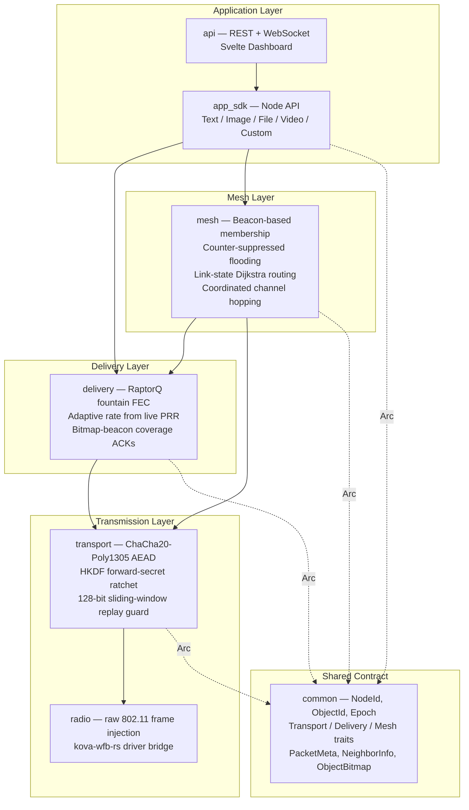
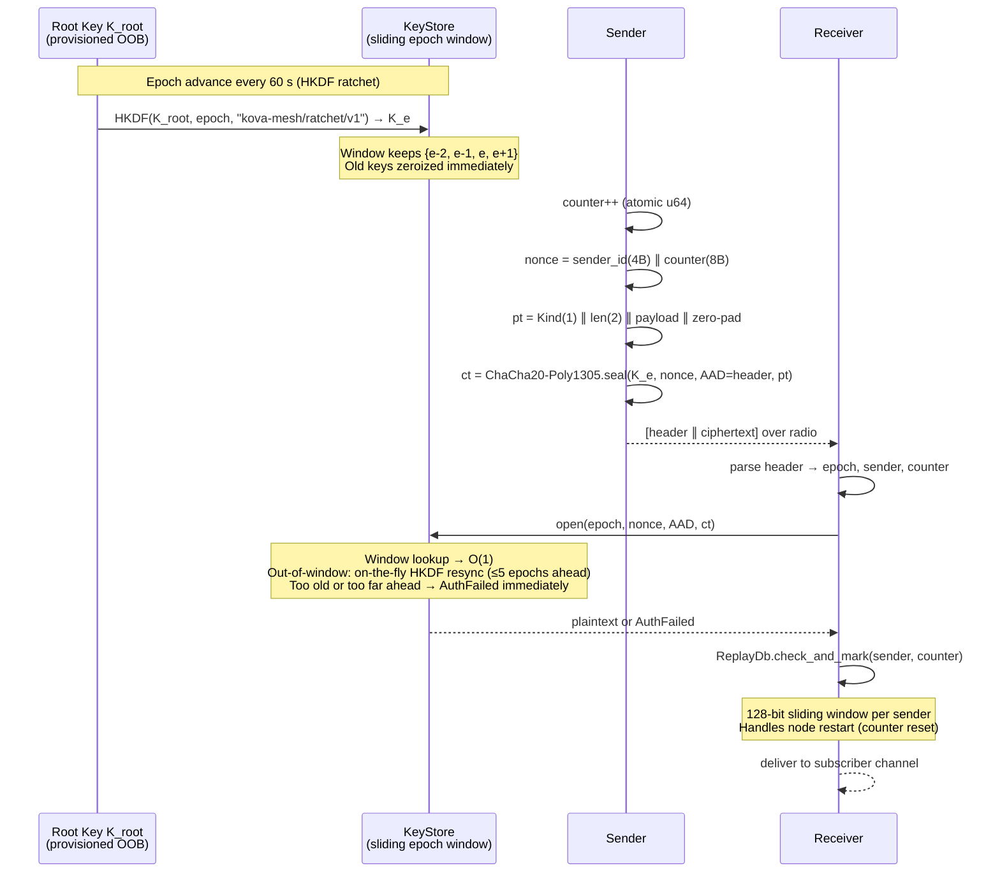
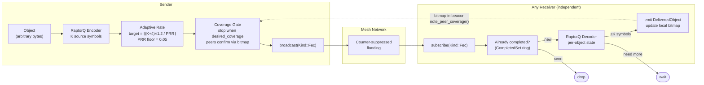
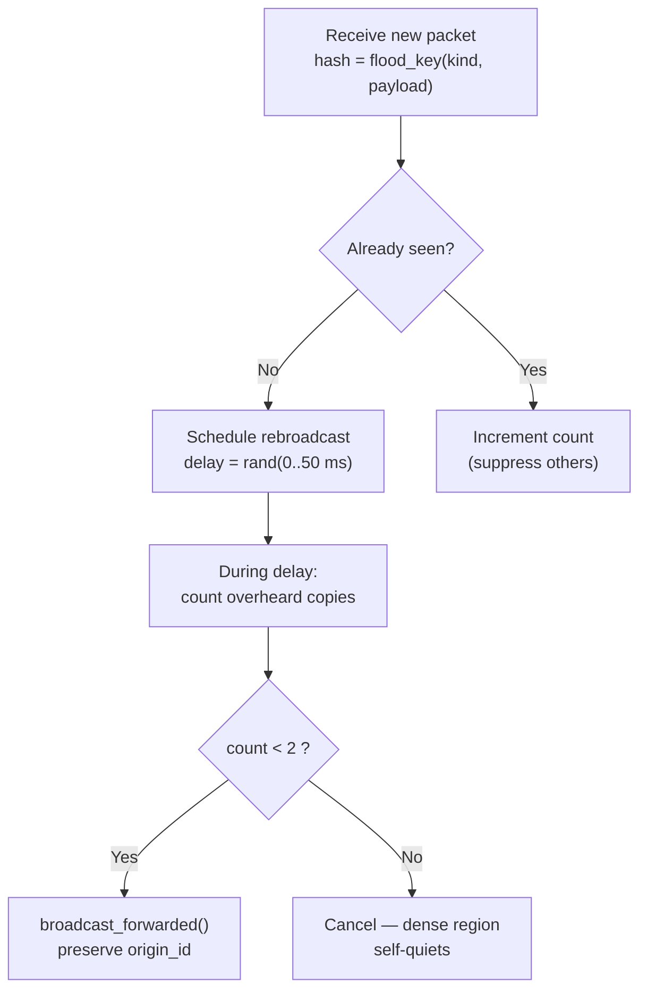
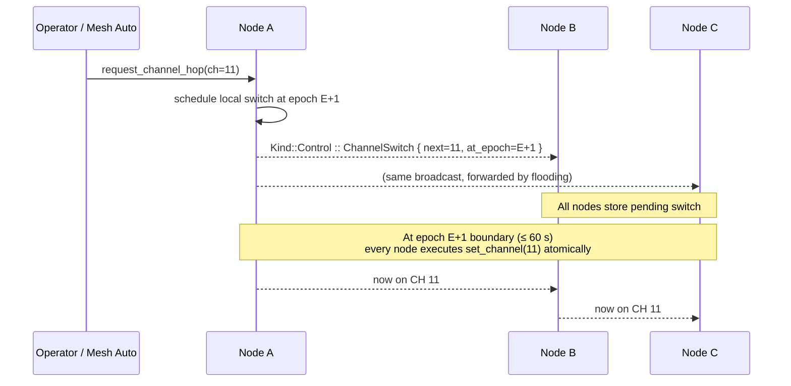
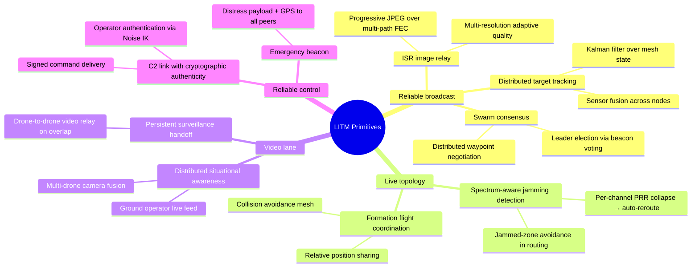

# LITM — Lost in the Mes(h)s

> A battle-hardened mesh communication stack for autonomous drone swarms, built from first principles over raw IEEE 802.11 frames.

---

## What We Built

**LITM** is a full-stack tactical mesh communication system that replaces every layer from the radio driver to the application API. It does not sit on top of 802.11 association, CSMA/CA, or any existing IP stack — it injects and captures raw frames using a monitor-mode WiFi adapter, giving the protocol complete control over every byte on the air.

The stack is written entirely in Rust (edition 2024), targeting Linux with Realtek RTL8812AU adapters. It is structured as a Cargo workspace of five focused crates, each owning a single protocol layer and tested independently with mocked dependencies.

---

## Architecture Overview



---

## Transmission Layer

### Wire Frame

Every packet on the air is a raw IEEE 802.11 unicast frame addressed to a sentinel MAC. All nodes listen in monitor mode and demultiplex by our own 22-byte header — never falling back to the legacy broadcast rate.

```
 0   1   2        6        10       14               22
 +---+---+--------+--------+--------+----------------+------...------+
 |ver|flg| epoch  | sender | origin |    counter     | ciphertext+tag|
 | 1 | 1 |  4 BE  |  4 BE  |  4 BE  |     8 BE       |   variable    |
 +---+---+--------+--------+--------+----------------+------...------+
 \___________________________ AAD (22 B) ___________/\__ AEAD out __/
```

- **sender** — last-hop forwarder (updated on every relay).
- **origin** — original creator, preserved unchanged through all flood hops.
- Per-packet overhead: **38 bytes** (22 header + 16 AEAD tag).

### Encryption System



**Security properties:**

- **ChaCha20-Poly1305** — 256-bit AEAD; immune to timing side-channels on hardware without AES-NI.
- **Forward secrecy** — HKDF epoch ratchet; past keys are zeroized immediately on advance.
- **Low probability of intercept (LPI/LPD)** — `Kind` byte lives inside the ciphertext; FEC and Control frames are padded to `MAX_PLAINTEXT` so all non-beacon frames are length-indistinguishable.
- **Replay protection** — per-sender 128-bit sliding window, verified only after AEAD passes (unauthenticated frames cannot poison window state).
- **Clock-skew tolerance** — sliding key window of 4 epochs ± bounded on-the-fly resync for nodes up to 5 epochs ahead; DoS-bounded: past the cap, a single bounds check returns `AuthFailed` with zero HKDF work.
- **Nonce uniqueness** — `sender_id ∥ counter` is globally unique per forwarder without any coordination.
- **Post-compromise recovery** — `Kind::Control` rekey message; new root distributed pairwise over Noise IK to surviving peers.

---

## Delivery Layer — RaptorQ Fountain FEC



**Key properties:**

- **Fountain code** — a single broadcast stream serves all receivers simultaneously; no per-receiver retransmits.
- **Adaptive rate** — `target_symbols = ⌈(K + margin) / PRR⌉`; PRR is measured live from beacon sequences and RSSI. A dead link (PRR → 0.05 floor) never causes infinite retransmit blowup.
- **Coverage-driven termination** — the sender watches peer beacon bitmaps; transmission stops as soon as `desired_coverage` nodes confirm decode, freeing the channel for other traffic.
- **Mid-stream join** — every FEC symbol carries the full `ObjectTransmissionInformation` (OTI); a receiver that misses the first symbols can reconstruct without any re-send.
- **Relay-friendly** — relays forward encrypted symbol packets without ever decrypting them; multi-path mesh delivery falls out naturally.
- **Telemetry** — a `RaptorEvent` stream (progress, overhead symbols, matrix density) feeds the dashboard's live FEC visualisation over WebSocket.

---

## Mesh Layer

### Neighbor Discovery & Failure Detection

Every node broadcasts a signed, encrypted beacon every ~100 ms (jittered ±10%):

```rust
struct BeaconPayload {
    epoch: u32,
    beacon_seq: u32,
    neighbors_heard: Vec<(NodeId, u8 /* PRR × 255 */)>,
    decoded: ObjectBitmap,  // 256-bit ring of recently decoded objects
}
```

A peer is evicted after 2 000 ms of silence (≈ 20 missed beacons). No unicast probes — liveness is inferred entirely from passive overhearing.

### PRR Estimation

Link quality is a conservative blend of RSSI and actual beacon delivery:

```
PRR_new = 0.3 × PRR_old + 0.7 × min(rssi_prr, delivery_prr)
rssi_prr = clamp((RSSI + 90) / 40, 0, 1)   // −90 dBm → 0, −50 dBm → 1
delivery_prr = 1 / (received_seq − expected_seq + 1)
```

### Counter-Suppressed Flooding



FEC symbols use a structural key `(object_id, esi)` — O(1) dedup without hashing 1 400 bytes. All other kinds use the first 8 bytes of BLAKE3.

### Link-State Routing

Each beacon carries the sender's full neighbor list. Every node builds the complete topology graph locally from received beacons for optimal multi-hop paths — no routing convergence protocol needed.

### Coordinated Channel Hopping

Anti-jamming channel switches are **zero-disruption**:



Epoch boundaries are coordinated by wall-clock time (UNIX seconds / 60), so no additional synchronisation message is needed.

---

## Application Layer

### SDK — `app_sdk`

A high-level Rust API that applications consume:

```rust
// Start a node (one line)
let node = NodeBuilder::new(node_id, "shared-password", "wlan0").build()?;

// Reliable delivery
node.send(MessagePayload::Text { content: "Target at grid 472".into() })?;
node.send(MessagePayload::Image { mime: "image/jpeg".into(), bytes })?;

// Unreliable low-latency video lane
let streamer = VideoStreamer::new(VideoChannel::new(node.transport()), VideoQuality::Balanced);
streamer.send_frame(&rgb_pixels, width, height)?;

// Mesh awareness
let neighbors: Vec<NeighborInfo> = node.neighbors(); // with live PRR + RSSI
let topology = node.topology();                       // full link-state graph
node.request_channel_hop(11)?;                        // anti-jam
```

**Message types:** `Text`, `Image`, `File`, `Custom { tag, bytes }` — all carried over RaptorQ FEC with AEAD, reliable delivery.

**Video lane** (`Kind::Video`): fire-and-forget JPEG chunking at up to 1 391 bytes/chunk, three quality presets (160×120 to 640×480), hardware-accelerated resize. Incomplete frames are silently discarded; the last good frame is held.

### REST + WebSocket API (`api`)

An Axum HTTP server bridges the Rust mesh stack to any frontend:

| Endpoint                    | Purpose                                                                          |
| --------------------------- | -------------------------------------------------------------------------------- |
| `GET /api/data`             | Full node state: neighbors, topology, messages, radio info, active video streams |
| `POST /api/send`            | Send text or base64 image into the mesh                                          |
| `POST /api/video/frame`     | Push a camera frame into the unreliable video lane                               |
| `GET /api/video/stream/:id` | MJPEG multipart stream for any active remote node                                |
| `GET /api/raptor/ws`        | WebSocket: live RaptorQ telemetry (progress, overhead, matrix density)           |
| `POST /api/channel/hop`     | Trigger a coordinated channel hop across all mesh nodes                          |

### Dashboard

A Svelte web dashboard consumes the API and shows:

- Live interactive map with node positions and signal strength
- Mesh topology graph with PRR-weighted edges
  

- Real-time FEC decoding animation (matrix fill, overhead symbols)
  

- Live video streams from any node in the mesh
  

- Channel control panel


---

## Judging Dimensions

### Resilience under jamming and spoofing (34%)

| Threat                        | Mitigation                                                                               |
| ----------------------------- | ---------------------------------------------------------------------------------------- |
| Passive eavesdrop             | ChaCha20-Poly1305 AEAD; Kind byte and payload inside ciphertext                          |
| Active jammer on one channel  | Coordinated channel hopping at epoch boundary — entire mesh switches atomically          |
| Replay attack                 | Per-sender 128-bit sliding window; checked after AEAD (forged frames never poison state) |
| Spoofed frames                | AEAD authentication tag rejection; wrong key → `AuthFailed`                              |
| Node capture / key extraction | HKDF epoch ratchet; past keys zeroized immediately; forward secrecy holds                |
| Jammed link vs. dead peer     | PRR distinguishes the two: PRR collapse alone does not evict; beacon silence does        |
| Network partition             | Counter-suppressed flooding recovers automatically when the partition heals              |
| Node restart                  | Replay window detects counter resets and re-accepts the peer                             |

### Efficient use of limited radio bandwidth (33%)

| Mechanism                                | Bandwidth impact                                                       |
| ---------------------------------------- | ---------------------------------------------------------------------- |
| High-MCS unicast (no broadcast fallback) | 5–30 Mbps vs. 1–6 Mbps at broadcast rate                               |
| 2.4 GHz HT20 MCS 0 at 23 dBm             | Maximum range per milliwatt                                            |
| Counter-suppressed flooding (K=1)        | Dense regions self-quiet; 1× overhead at any density                   |
| RaptorQ adaptive rate                    | Sends exactly enough symbols for observed PRR; no excess on good links |
| Coverage-driven termination              | Stops transmitting as soon as all targets have decoded                 |
| Bitmap beacon piggybacking               | Coverage ACKs are free — no extra packets                              |
| Beacon natural size (not padded)         | ~100 B beacon vs. 1 400 B if padded; 14× beacon savings                |
| FEC + Control padded to MAX_PLAINTEXT    | LPI/LPD for data traffic; observer cannot distinguish types            |
| Video fire-and-forget lane               | No FEC overhead for latency-sensitive streams                          |

### Innovative applications (33%)

**Delivered at hackathon:**

- Live encrypted video streaming from drone cameras through the mesh with MJPEG relay
- Real-time interactive topology map with PRR-weighted links and node markers
- RaptorQ decoder visualisation — watch symbols fill the matrix in real time
- Operator-triggered coordinated anti-jam channel hops from the dashboard

**Ready to build in hours with existing primitives:**



---

## Extension Roadmap

| Item                             | Effort           | Notes                                                              |
| -------------------------------- | ---------------- | ------------------------------------------------------------------ |
| Noise IK pairwise join handshake | ~1 day           | Architecture already designed; `snow` crate wired in               |
| Distributed target tracking      | ~1 day           | `Custom` message type, Kalman filter, topology API                 |
| Progressive ISR image relay      | ~hours           | Multi-path FEC already works; add resolution ladder                |
| Swarm leader election            | ~hours           | Beacon priority field + epoch-sync voting                          |
| Spectrum-aware jamming reroute   | ~hours           | PRR collapse → `request_channel_hop` auto-trigger                  |
| GPS / IMU telemetry fusion       | ~1 day           | `Custom` message type, sensor-data schema                          |
| kHz-rate FHSS                    | hardware-limited | RTL8812AU channel latency is 5–15 ms; not feasible on this chipset |
| Full MLS group encryption        | ~2 days          | Correct long-term answer; too heavy for a weekend                  |

---

## Technology Stack

| Layer          | Technology                      | Reason                                                  |
| -------------- | ------------------------------- | ------------------------------------------------------- |
| Radio driver   | `kova-wfb-rs`                   | Raw 802.11 frame injection on RTL8812AU                 |
| AEAD           | `chacha20poly1305` (RustCrypto) | Constant-time; no AES-NI required                       |
| Key derivation | `hkdf` + `sha2`                 | Standard HKDF-SHA256 ratchet                            |
| Hashing        | `blake3`                        | Flood dedup key; ~3× faster than SHA-256                |
| FEC            | `raptorq`                       | Luby-Transform fountain code; O(n) encode/decode        |
| Serialisation  | `postcard`                      | No-std compatible; compact varint encoding for beacons  |
| Async runtime  | `tokio`                         | Per-crate task spawning; mpsc channels for backpressure |
| HTTP API       | `axum`                          | Lightweight REST + WebSocket server                     |
| Frontend       | Svelte + TypeScript             | Reactive dashboard; Map + FEC visualisation             |
| Key lifecycle  | `zeroize`                       | Guaranteed memory wipe of key material on drop          |
| Logging        | `tracing`                       | Structured, per-crate span logging                      |

---

## Radio Configuration

| Parameter  | Value                  | Rationale                                                      |
| ---------- | ---------------------- | -------------------------------------------------------------- |
| Band       | 2.4 GHz                | ~8 dB less free-space path loss vs. 5 GHz (Friis equation)     |
| Channel    | 6 (HT20)               | Non-overlapping; 20 MHz gives 3 dB better noise floor vs. HT40 |
| MCS index  | 0 (BPSK ½)             | Best receiver sensitivity; ~3–5 dB over MCS 1                  |
| TX power   | 23 dBm                 | Hardware/regulatory max                                        |
| Frame type | Unicast (sentinel MAC) | Avoids 1–6 Mbps broadcast rate fallback                        |
